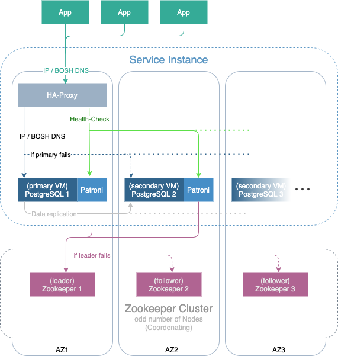

# Table of Contents
1. [OSB-PostgreSQL](#osb-postgresql)
   * 1.1 [Cluster Overview](#cluster-overview)
   * 1.2 [Dependencies](#dependencies)
2. [Plan properties](docs/plan-properties.md)
---
# OSB-PostgreSQL

PostgreSQL is a powerful, object-relational open-source database-system. It has actively been developed for over 30 years
and earned a good reputation in regard to reliability, durability of functions and performance.  
This project is part of our service broker project. For documentation see [evoila/osb-docs](https://github.com/evoila/osb-docs).

## Cluster Overview

Using PostgreSQL, it is possible to transfer [Write-Ahead Logging (WAL)](https://www.postgresql.org/docs/current/wal-intro.html)
synchronously or asynchronously to standby-nodes via [Streaming Replication (SR)](https://www.postgresql.org/docs/current/warm-standby.html#STREAMING-REPLICATION).  
Additionally, the Software "Patroni" is used with a HA-Proxy inside the OSB, so that an automatic switch to another node occurs
in case of a failure of the primary-node. Inside PostgreSQL, there is no load-balancing provided.

##Dependencies

- Zookeeper

Zookeeper is mandatory for the implementation of Patroni that we use in order to manage the PostgreSQL clusters. 
Therefore, a cluster with 3 Zookeper instances should be installed via Bosh. This cluster will then be used by all PostgreSQL clusters.

///
# cf-service-broker-Postgres
Cloud Foundry Service Broker providing Postgres Service Instances. Supports deployment to OpenStack and Existing Postgres servers. Configuration files and deployment scripts must be added. 

Restore Tests:
pg_restore -U beuidgjdxi -c -d DD69H8D3-7876-4056-A0EE-DE8D3498259T -v ~/Downloads/190509_prod_1_0_dump.tar -W -h 10.245.0.3